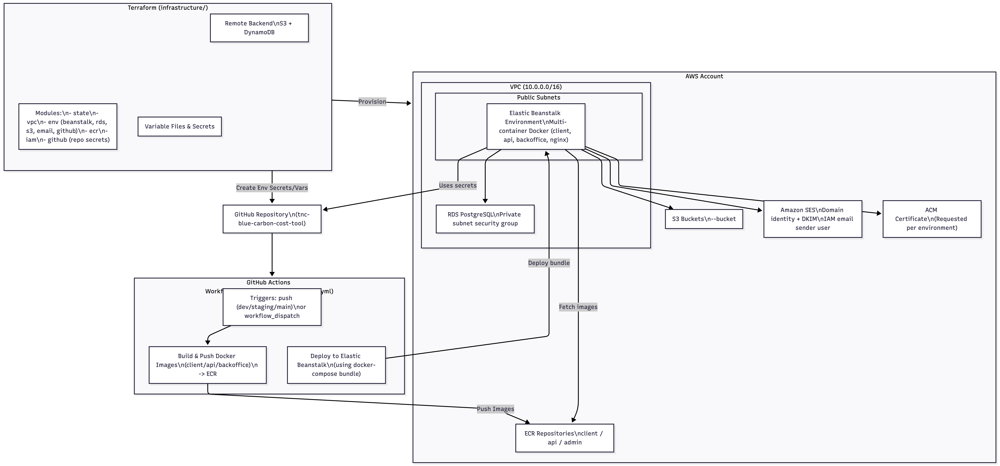

# Infrastructure & Deployment Guide

This document explains how the infrastructure in the `infrastructure/` folder is organised, how Terraform provisions the AWS resources, how configuration values and secrets flow through the system, and how the GitHub Actions deployment pipeline (`.github/workflows/deploy.yml`) operates. It is aimed at engineers who are familiar with AWS, Terraform, Docker, and GitHub Actions

---

## 1. Repository Layout

| Path | Description |
|------|-------------|
| `main.tf`, `providers.tf`, `variables.tf` | Root Terraform configuration, provider definition, and shared input variables. |
| `modules/` | Reusable Terraform modules (networking, RDS, SES, Elastic Beanstalk, GitHub integration, etc.). |
| `vars/terraform.tfvars` & `vars/local.tfvars` | Example variable files for non-secret and local development overrides. |
| `source_bundle/` | Assets that are zipped and uploaded to Elastic Beanstalk (Docker Compose template and Nginx configuration). |
| `.terraform.lock.hcl` | Provider versions locked by `terraform init`. |
| `../.github/workflows/deploy.yml` | GitHub Actions workflow that builds and deploys the application stack. |

All Terraform work should be executed from the `infrastructure/` directory.

---

## 2. Terraform Backend, Providers, and State

### Backend

Terraform uses an S3 backend declared in `main.tf`:

- **Bucket:** `blue-carbon-cost-terraform-state`
- **Key:** `state`
- **Region:** `us-east-2`
- **DynamoDB Table:** `blue-carbon-cost-terraform-state-lock` for state locking
- **AWS CLI profile:** `tnc-aws` (this has to match your configured AWS credentials)

> **Bootstrap note:** The backend bucket/table must exist before Terraform can store remote state. If you are provisioning a fresh account, temporarily comment out the `backend "s3" { ... }` block, run `terraform apply -target=module.state` using a local backend to create the S3 bucket and DynamoDB table, and then re-enable the backend block followed by `terraform init -migrate-state`.

### Providers

- `provider "aws"` (root level) sources credentials from the selected AWS profile (`var.aws_profile`) and region (`var.aws_region`).
- Several modules declare their own provider configurations when needed (e.g., `modules/state` uses a dedicated AWS provider to guarantee the bootstrap region/profile).
- `provider "github"` is defined in `modules/github` and uses a Personal Access Token supplied via Terraform variables.
- The `random` provider is implicitly required through the use of `random_password` and `random_string` resources.

### Variable Management

Core input variables are declared in `variables.tf`. Secrets such as GitHub tokens or authentication credentials should **not** be committed; instead, populate them through environment variables (`TF_VAR_<name>`) or encrypted variable files. The `vars/local.tfvars` file provides sample values only and must not be reused in production.

---

## 3. High-Level Architecture

Terraform provisions the following layers:

1. **Remote State (`module.state`):** S3 bucket + DynamoDB table for Terraform state management.
2. **Networking (`module.vpc`):** A VPC with two public subnets (us-east-2a/2b), an Internet Gateway, and routing for internet access. Outputs include subnet IDs, VPC ID, CIDR block, and availability zones.
3. **Elastic Container Registry (`module.client_ecr`, `module.api_ecr`, `module.admin_ecr`):** Three ECR repositories (`<project>-client`, `-api`, `-admin`) with lifecycle policies that keep one tagged image per environment plus the latest three additional images.
4. **CI/CD IAM (`module.iam`):** Dedicated IAM user (`BCCProjectPipelineUser`) with AWS Elastic Beanstalk and ECR privileges. Access key/secret are exported for GitHub Actions secrets.
5. **Environment Stacks (`module.env` for `dev`, `staging`, `production`):** Each stack composes multiple submodules:
   - **Elastic Beanstalk (`modules/beanstalk`):** Multi-container Docker environment running client, API, backoffice, and nginx reverse proxy.
   - **Relational Database (`modules/rds`):** PostgreSQL instance with Secrets Manager entry for credentials.
   - **Storage (`modules/s3`):** Environment-specific S3 bucket (force_destroy enabled) for application assets.
   - **Email (`modules/email`):** Amazon SES domain identity, DKIM tokens, and IAM user for sending emails. DNS validation must be completed externally.
   - **Certificates:** Requests an ACM certificate for the environment’s domain (DNS validation required).
   - **GitHub Integration (`modules/github`):** Creates GitHub environment objects, secrets, and variables derived from Terraform outputs so GitHub Actions can build and deploy.

6. **Organization-wide GitHub Secrets (`module.github` in root):** Populates repository-level secrets/variables shared across environments (e.g., ECR repo names, AWS region, pipeline user keys, Mapbox token).

---

## 4. Configuration & Secret Flow

1. Terraform generates or fetches sensitive values:
   - `random_password` and `random_string` resources create API tokens, cookie secrets, and NextAuth secrets per environment.
   - The RDS module stores DB credentials in AWS Secrets Manager and outputs them back to Terraform.
   - The SES module creates an IAM access key for sending email.

2. These values are passed into the environment-specific GitHub module, which writes them as **GitHub Actions environment secrets** (one for each environment). Plain text environment variables (e.g., API URLs, feature flags, Mapbox tokens) are stored as GitHub environment variables.

3. The root-level GitHub module exports shared secrets/variables (ECR repo names, AWS credentials, project name) as **repository-level secrets** referenced by the deployment workflow across all environments.

4. During deployment, GitHub Actions retrieves the secrets/variables and injects them into Docker build arguments and Elastic Beanstalk deployments.

5. Runtime services consume the secrets via environment variables defined by Docker Compose (generated during deployment) and the Nginx reverse proxy configuration inside the source bundle.

---

## 5. Running Terraform

### Prerequisites

- AWS CLI configured with the required profile(s) and permissions to manage VPC, RDS, Beanstalk, ECR, SES, ACM, IAM, S3, and Secrets Manager.
- Terraform `>= 1.9` and consistent provider versions (locked in `.terraform.lock.hcl`).
- GitHub personal access token with `repo` and `admin:repo_hook` scopes (for environment provisioning).
- Access to DNS management for the project domains to validate ACM certificates and Amazon SES records.

### Typical Workflow

```bash
cd infrastructure

# Initialise providers and the remote backend
terraform init

# Create or inspect plans (choose the appropriate tfvars file)
terraform plan -var-file=vars/terraform.tfvars

# Apply changes (always review the plan first)
terraform apply -var-file=vars/terraform.tfvars

# Show outputs (sensitive values are redacted unless explicitly flagged)
terraform output
```

Use `TF_LOG` environment variable for debugging if needed. Avoid committing updated `.tfvars` files that include secrets.

### Targeted Operations

- To rotate credentials (e.g., SES access key, database password), taint the relevant `random_password` or `aws_iam_access_key` resource and re-apply.
- To provision a single environment, you can target the specific module: `terraform apply -target=module.dev` (not recommended long-term but useful for troubleshooting).

---

## 6. Making Infrastructure Changes

1. **Adjusting configuration values:**
   - Update variables directly in `main.tf` or via the chosen `.tfvars` file.
   - Re-run `terraform plan` to confirm the delta.

2. **Adding a new environment:**
   - Duplicate the relevant `module "env"` block in `main.tf`, adjust `domain`, `environment`, and resource sizing.
   - Ensure corresponding GitHub environment(s) are created or update the `modules/github` logic.
   - Update `.github/workflows/deploy.yml` so the pipeline routes to the new environment (branch naming, Docker tags, deployment step).

3. **Extending modules:**
   - Encapsulate new AWS resources inside existing modules or create new modules under `modules/` to keep `main.tf` succinct.
   - Follow the established tagging and naming conventions based on `var.project_name` and `var.environment`.

4. **State considerations:**
   - Always review Terraform state before destructive operations.
   - If resources were changed manually in AWS, import them (`terraform import`) so future plans remain clean.

---

## 7. Connecting to Provisioned Services

### AWS Console & CLI

- Most resources (VPC, Beanstalk environments, RDS instance, S3 buckets, SES) live in the region defined by `var.aws_region` (default `us-east-2`). Use the configured AWS profile when running CLI commands: `aws --profile <profile> ...`.

### Elastic Beanstalk Application Servers

- Each environment (`<project>-<env>-env`) runs as a multi-container Docker application. To inspect the running containers:
  1. Add your ssh public key to (`infrastructure/source_bundle/.ebextensions/authorized_keys.config`) if it's not already present, and redeploy the Beanstalk environment.
  2. Identify an instance with `aws elasticbeanstalk describe-environment-resources`.
  3. Ensure the EC2 instance has an SSH key pair associated (configure in the Beanstalk console if not already set).
  4. Connect via SSH and inspect Docker containers (`docker ps`).

### Database Access

- The PostgreSQL instance is only reachable inside the VPC (security group ingress limited to the VPC CIDR block). To connect:
  1. Add your ssh public key to (`infrastructure/source_bundle/.ebextensions/authorized_keys.config`) if it's not already present, and redeploy the Beanstalk environment.
  2. Establish an SSH tunnel from an Elastic Beanstalk instance or a bastion host in the VPC.
  3. You can retrieve the database credentials from the API container within the EC2 instance
  4. Connect using a PostgreSQL client while routing through the tunnel.

### Email (SES)

- Terraform provisions SES identities but does not complete DNS validation. Add the provided DKIM, SPF, and MAIL FROM records to your DNS provider. Until validation succeeds, SES may remain in sandbox mode.

### S3 Buckets

- One bucket per environment stores application assets. Bucket policies block all public access. Manage objects via the AWS Console or CLI (`aws s3 ls s3://<project>-<env>-bucket`).

### Certificates

- ACM certificates require DNS validation. Retrieve the validation options from `module.<env>.acm_certificate_domain_validation_options` if needed (`terraform output` can expose them when explicitly declared).

---

## 8. Deployment Pipeline (`.github/workflows/deploy.yml`)

### Triggers

- **Automatic:** Pushes to `dev`, `staging`, or `main` branches affecting application, shared, or infrastructure code.
- **Manual:** `workflow_dispatch` allows running the pipeline on demand.

### Environment Resolution

- The `set_environment_name` job maps branch names to deployment environments (`main` → `production`, otherwise the branch name).

### Change Detection

- `trigger_build` uses `dorny/paths-filter` to determine whether client, API, or backoffice components changed. A manual dispatch or production/staging push forces all builds.

### Build Jobs

Separate jobs build Docker images for the **client**, **API**, and **backoffice**:

1. Check out the repository.
2. Configure AWS credentials using the pipeline IAM user (secrets injected by Terraform).
3. Log in to ECR and build images with `docker/build-push-action@v6`.
4. Tag each image with both the Git SHA and the environment name (`dev`, `staging`, `production`).
5. Push the images to the appropriate ECR repositories.

Build arguments pull environment variables and secrets from the GitHub environment configured by Terraform (for example, database credentials, Mapbox token, NextAuth configuration, and basic auth credentials).

### Deployment Job

Runs after at least one build succeeds:

1. Reuses AWS credentials and ECR login.
2. Generates a Docker Compose file (`infrastructure/source_bundle/docker-compose.yml`) referencing the environment-tagged images and an Nginx reverse proxy configuration.
3. Zips the `source_bundle/` directory, producing `deploy.zip` for Elastic Beanstalk.
4. Deploys the bundle using `einaregilsson/beanstalk-deploy@v22`, targeting the `<project>-<env>` application/environment pair.

The Beanstalk environment then spins up the four services (client, API, backoffice, nginx) defined in the compose file.

### Updating the Pipeline

- If you rename ECR repositories, add new services, or change environment names, update Terraform so GitHub secrets remain in sync, and modify the workflow accordingly.
- For additional branches/environments, edit the trigger section and adjust the environment mapping logic.

---

## 9. Troubleshooting Tips

- **Terraform init fails with missing bucket/table:** Bootstrap the remote state using the `module.state` instructions above.
- **ACM certificate stuck in `PENDING_VALIDATION`:** Confirm DNS records were propagated and that the hosted zone matches the requested domain.
- **SES emails failing:** Ensure the domain identity is verified and, if still in sandbox, request production access from AWS.
- **Deploy job fails with missing secrets:** Regenerate Terraform outputs (`terraform apply`) so GitHub environment secrets are re-synchronised.
- **Elastic Beanstalk rolling back:** Check the EB event log and container logs (`/var/log/eb-engine.log`, Docker logs) on the instances; verify Docker images exist in ECR with the expected tags.

---

## 10. Additional Resources

- [Terraform AWS Provider Docs](https://registry.terraform.io/providers/hashicorp/aws/latest/docs)
- [Terraform GitHub Provider Docs](https://registry.terraform.io/providers/integrations/github/latest/docs)
- [AWS Elastic Beanstalk Multicontainer Docker Guide](https://docs.aws.amazon.com/elasticbeanstalk/latest/dg/create_deploy_docker_ecs.html)
- [GitHub Actions Documentation](https://docs.github.com/actions)

With this overview, a new contributor should be able to understand the existing infrastructure, provision updates with Terraform, and manage the deployment pipeline end-to-end.

---

## 11. Architecture Diagram


